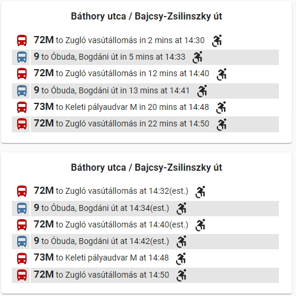

[](https://github.com/custom-components/hacs)

<p><a href="https://www.buymeacoffee.com/6rF5cQl" rel="nofollow" target="_blank"></a></p>

# Lovelace custom card for BKK Stop Information

This Lovelace custom card displays Budapest Public Transportation (BKK)
line information departing in the near future from a configurable stop.<p>
This custom card depends on the BKK Stop Information custom component that you may find at
[https://github.com/amaximus/bkk_stop](https://github.com/amaximus/bkk_stop/).

Lovelace UI does not support platform attributes natively.<br />
Inspired by [entity-attributes-card](https://github.com/custom-cards/entity-attributes-card)
on handling attributes in Lovelace, a Lovelace custom card was a dept and now made available for BKK Stop.

#### Installation
The easiest way to install it is through [HACS (Home Assistant Community Store)](https://github.com/hacs/frontend),
search for <i>bkk</i> and select BKK Stop Card from Plugins.<br />
If you are not using HACS, you may download bkk-stop-card.js and put it into $homeassistant_config_dir/www.<br />

#### Lovelace UI configuration

Configuration parameters:<br />

---
| Name | Optional | `Default` | Description |
| :---- | :---- | :------- | :----------- |
| entity | **N** | - | name of the sensor of bkk_stop platform|
| hide_in_mins | **Y** | `false` | Hide in_minutes information|
| hide_at_time | **Y** | `true` | Hide at_time information|
| hide_predicted_at_time | **Y** | `true` | If set to false, this will show predicted times with an '(est.)' suffix, when estimated arrival times are available, otherwise it will show the time according to schedule |
| name | **Y** | `` | If specified it will overwrite the card title/station name |
---

For yaml mode Lovelace dashboard add the lines below to your ui-lovelace.yaml. For non-yaml dashboard use: overview → edit dashboard → 3 dot again → raw edit and add the card info there.
The entity should be the sensor of bkk_stop platform you defined.
```
resources:
  - {type: module, url: '/www/community/bkk-stop-card/bkk-stop-card.js'}

    cards:
      - type: custom:bkk-stop-card
        entity: sensor.bkk7u
        hide_in_mins: false # it makes sense to set this to false if hide_predicted_at_time is true, as in_mins is calculated from "scheduled" times
        hide_at_time: false 
        hide_predicted_at_time: true
      - type: custom:bkk-stop-card
        entity: sensor.bkkxu
        hide_in_mins: true
        hide_at_time: true
        hide_predicted_at_time: false

```

Lovelace UI:<br />

